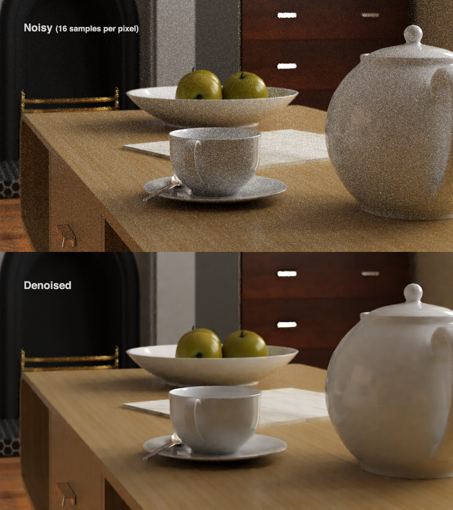
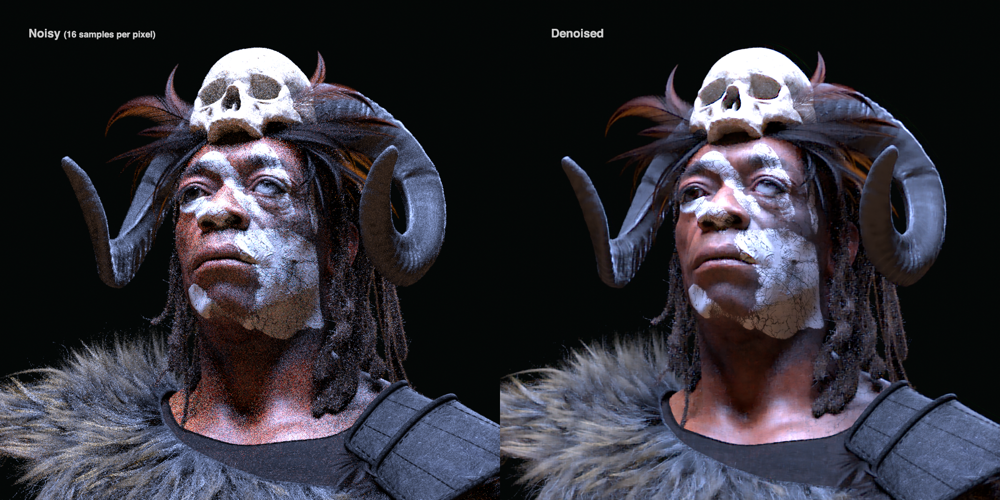
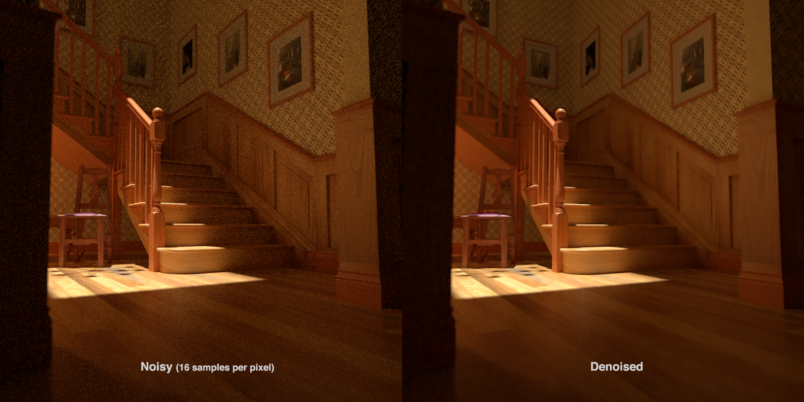

# KPN Raytrace Denoiser 
[](LICENSE.md)


## Table of Contents
- [Overview](#overview)
- [Installation](#installation)
- [Usage](#usage)
- [Results](#results)
- [Data and Improvements](#data-and-improvements)
- [Input Requirements](#input-requirements)
- [Acknowledgements](#acknowledgements)
- [License](#license)


## Overview <a name="overview"></a>
This project is an implementation of a Kernel Predicting Neural Network (KPN) trained to denoise raytraced renders. Raytracers are known for producing high-quality imagery, but often require a significant number of samples - thus time - to converge. The KPN network can take low sample, noisy renders and accurately predict a denoised version in a fraction of the time. The network consists of two models trained to denoise the diffuse and specular components respectively. After each component is denoised, they are recombined to generate the final output.


## Installation <a name="installation"></a>
To run this project, you will need Python 3.x and the following dependencies:

- Tensorflow 2.x
- Numpy
- Imath
- OpenExr

You can install these dependencies using pip:
```python
pip install tensorflow numpy Imath OpenExr
```
Alternatively, install using the requirements file:
```python
pip install -r requirements.txt
```

You can also build OpenExr from source code available at:
https://github.com/AcademySoftwareFoundation/openexr/releases


## Usage <a name="usage"></a>
To denoise a render, run the following command in main.py:

```python
KPNModel().predict(filepath='<path/to/your/render.exr>', overlap=48)
```
*An example render to test on is provided here: img/example/noisy_example.exr*

The overlap argument specifies the pixel overlap for each 64x64 denoising sample used to mitigate artifacts at the edge of each predicted sample. A larger overlap will increase quality, memory requirements, and processing time. The denoised prediction(s) will be saved to the same directory with each file appended with a '_denoised' suffix.


## Results <a name="results"></a>
The KPN model is effective at reducing noise in low sample monte carlo renders, achieving results comparable to high sample count renders that would otherwise require significantly longer render times.






- Noisy rendertime: ~45 seconds per frame
- Ground truth rendertime: ~1.5 hours per frame
- Denoising runtime: ~10 seconds per frame

*Rendering was performed on a 16-core/3.60 GHz CPU, while denoising was done using a GTX 1080 GPU*


## Input Requirements <a name="input-requirements"></a>
Each noisy exr input must contain the following AOV's / render passes:
- RGBA + variance
- Normal + variance
- Albedo + variance
- Depth + variance
- Emission

The denoised exr output consists of these channels:
- RGBA
- Specular
- Diffuse (everything that isn't specular including SSS, refraction etc.)

The training dataset is not included as the multichannel exr's are quite large. The training hyperparamters, and associated preprocessing utilities are included however.


## Data and Improvements <a name="data-and-improvements"></a>
The KPN model takes two inputs: the first input contains the primary RGB channels to be denoised, and the second input is a series of utility passes output from the renderer to provide additional spatial context. The model uses two parallel convolutional processes, one for each input, which are concatenated and convolved with a predictive kernel to produce the denoised output. While the diffuse and specular models are identical in architecture, they differ in the primary RGB channels they were trained on.

To train our models, we utilized approximately 100 1024x1024 pixel renders, each with both a noisy and ground truth version. The renders were generated using Arnold for Maya, with the noisy version output at 16 samples per pixel and the ground truth renders captured at 1024 samples per pixel. We divided each render into 64x64 pixel chunks and fed them into the network, using mini-batching during training to accommodate memory and hardware limitations.

Improvements could be made by expanding the dataset to include a more robust set of lighting setups and scenes to further generalize the model and improve accuracy. Additionally, incorporating temporal samples from surrounding frames in an animated sequence could help to stabilize predictions and further enhance the model's performance.


## Acknowledgements <a name="acknowledgements"></a>
This project was inspired by the work of [Bako et al.](https://la.disneyresearch.com/wp-content/uploads/Kernel-Predicting-Convolutional-Networks-for-Denoising-Monte-Carlo-Renderings-Paper33.pdf)
Supplementary scene files from [Benedikt Bitterli](https://benedikt-bitterli.me/resources/) were leveraged for validation and testing.


## License <a name="license"></a>
This project is licensed under the MIT License - see the LICENSE.md file for details.